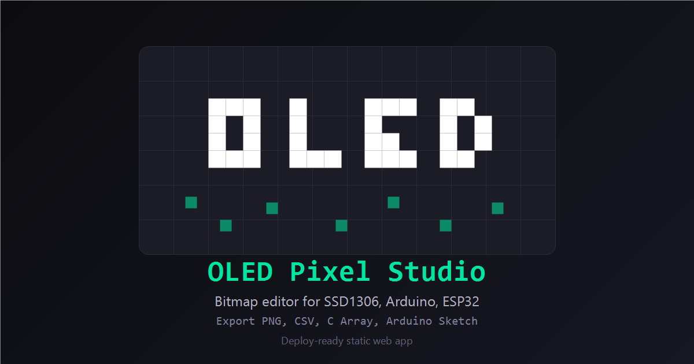

<div align="center">



<br/>

# OLED Pixel Studio

**Free browser-based bitmap editor for SSD1306, Arduino & ESP32 OLED displays**

[](https://oled-pixel-editor.netlify.app)
[](LICENSE)
[]()
[]()

<br/>

> Design pixel art for OLED displays visually — then export a **ready-to-flash Arduino sketch** in one click.
> No installation. No account. No backend. Just open and draw.

<br/>

[**🔴 Try it Live**](https://oled-pixel-editor.netlify.app) · [**📺 BlinkNBuild YouTube**](https://www.youtube.com/@BlinkNBuild) · [**🐛 Report a Bug**](../../issues) · [**💡 Request a Feature**](../../issues)

</div>

---

## ✨ Why I Built This

Every time I started an ESP32 or Arduino project with an SSD1306 OLED, I hit the same wall — I needed a custom bitmap and had no fast, accurate, free tool that exported real Arduino code.

So I built **OLED Pixel Studio** — a miniature MS Paint, built specifically for OLED display workflows. Design your graphic pixel by pixel, hit export, and flash it directly to your board.

---

## 🚀 Features

### 🖊 Drawing Tools
| Tool | Shortcut | Description |
|------|----------|-------------|
| Pencil | `P` | Click to toggle pixels, drag to paint. Auto-detects draw/erase mode per stroke |
| Eraser | `E` | Always erases — respects brush size |
| Flood Fill | `F` | Fills contiguous regions. Click ON pixel to erase, OFF pixel to fill |
| Select | `S` | Rectangular marquee with move, resize, copy, cut, paste, crop |

### ◻ Shape Tools (15 tools)

Line · Rectangle · Filled Rectangle · Ellipse · Filled Ellipse · **Perfect Circle** · Filled Circle · Triangle · Filled Triangle · Diamond · Filled Diamond · Star · Arrow · Rounded Rectangle · Cross

> Hold **Shift** while dragging the Ellipse tool to constrain it to a perfect circle.

### ⚙️ Canvas Controls
- **Brush size** — 1px to 64px with circular dilation for clean thick strokes
- **16 resolution presets** — 128×64, 128×32, 96×16, 72×40, 64×48, 64×32, 128×128, 96×64, 160×128, 256×64, 100×16, 100×32, 200×16, 50×16, 240×128, 240×64
- **Custom resolution** — any size up to 1024×1024
- **Zoom** — 50% to 2000% via scroll wheel, centred on cursor
- **Pan** — middle-click drag or Ctrl + drag
- **80-step undo / redo**

### ✂️ Selection System
- Drag marquee to select any area
- **Move** — drag inside selection (hold Alt to duplicate)
- **Resize** — 8 handles at corners and edges, nearest-neighbour scaling
- **Transforms scoped to selection** — Invert, Flip H/V, Rotate 90°, Crop
- Copy / Cut / Paste / Delete
- Arrow key nudge (1px) or Shift+Arrow (8px)

### 📤 Export Options
| Format | File | Use Case |
|--------|------|----------|
| **PNG** | `.png` | Share, document, preview |
| **CSV** | `.csv` | Save and re-import for continued editing |
| **C Array** | `.h` | Paste directly into any Arduino / ESP32 sketch |
| **Arduino Sketch** | `.ino` | Ready-to-flash — open in Arduino IDE and upload |

### 📱 Touch Support
Full pinch-to-zoom and touch drawing support for tablets and phones.

---

## ⚡ Quick Start

**No setup needed.** Just open the live tool in any browser:

```
https://oled-pixel-editor.netlify.app
```

Or download this repo and open `index.html` directly — no server, no install, no terminal.

---

## 🔌 Using the Exported Arduino Sketch

1. Draw your design in the editor
2. Click **Arduino Sketch** → downloads `oled_128x64.ino`
3. Open in Arduino IDE
4. Install libraries if needed — **Adafruit SSD1306** and **Adafruit GFX Library**
5. Select your board and COM port → Upload

The exported sketch is pre-configured for **ESP8266 NodeMCU** (`Wire.begin(D2, D1)`).

> ⚠️ **Arduino Uno / Nano users:** Remove the `Wire.begin(D2, D1)` line — Uno/Nano use hardware I²C on A4 (SDA) and A5 (SCL) automatically.

> ⚠️ **I²C Address:** Most SSD1306 modules use `0x3C`. If your display doesn't initialise, try changing `SCREEN_ADDRESS` to `0x3D`.

---

## ⌨️ Keyboard Shortcuts

| Key | Action |
|-----|--------|
| `P` | Pencil |
| `E` | Eraser |
| `F` | Flood Fill |
| `L` | Line |
| `R` | Rectangle |
| `C` | Circle |
| `T` | Triangle |
| `D` | Diamond |
| `S` | Select |
| `Ctrl+Z` | Undo |
| `Ctrl+Y` / `Ctrl+Shift+Z` | Redo |
| `Ctrl+C / X / V` | Copy / Cut / Paste selection |
| `Del` / `Backspace` | Delete selection |
| `Esc` | Cancel / Deselect |
| `Arrow keys` | Nudge selection 1px |
| `Shift + Arrow` | Nudge selection 8px |
| `Shift + drag` | Constrain Ellipse to perfect circle |
| `Alt + drag` | Duplicate selection instead of move |

---

## 🗺️ Roadmap

- [ ] **Image import** — import any PNG/JPG, auto-dither to monochrome, edit pixel by pixel
- [ ] **Video import** — import GIF/MP4, convert to frame-by-frame OLED animations
- [ ] **Multi-board export** — dedicated `.ino` presets for ESP32, Arduino Uno/Nano, STM32, Raspberry Pi Pico
- [ ] **Animation timeline** — create multi-frame animations and export as C arrays
- [ ] **Sprite library** — save and reuse common shapes and icons across projects

---

## 🛠️ Tech Stack

| Layer | Details |
|-------|---------|
| Rendering | HTML5 Canvas API — `requestAnimationFrame` loop |
| Pixel data | `Uint8Array(COLS × ROWS)` — 1 byte per pixel |
| Shape algorithms | Bresenham line, midpoint ellipse, scanline fill |
| Brush dilation | Circular kernel expansion per brush size |
| History | Stack of `Uint8Array` snapshots (80 steps) |
| Touch | Native touch events bridged to mouse handlers |
| Dependencies | Zero — no npm, no frameworks, no build step |
| Distribution | Single `index.html` file (~130KB) |

---

## 🤝 Contributing

Contributions are welcome! If you have an idea, found a bug, or want to add a feature:

1. Fork the repo
2. Create a branch: `git checkout -b feature/your-feature-name`
3. Make your changes in `index.html`
4. Test in Chrome, Firefox, and on mobile
5. Open a Pull Request with a clear description

For major features, open an issue first to discuss the approach.

---

## 📬 Feedback & Suggestions

Built out of my own project needs and actively improving it.

If you have suggestions, found a bug, or want to request a feature — open an [issue](../../issues) or reach out:

- 📺 **YouTube:** [BlinkNBuild](https://www.youtube.com/@BlinkNBuild)
- 🌐 **Live Tool:** [oled-pixel-editor.netlify.app](https://oled-pixel-editor.netlify.app)

---

## 📄 License

MIT License — free to use, modify, and distribute.

---

<div align="center">

Built with ❤️ by **[BlinkNBuild](https://www.youtube.com/@BlinkNBuild)**

*If this saved you time on a project, drop a ⭐ — it helps others find it too.*

</div>
